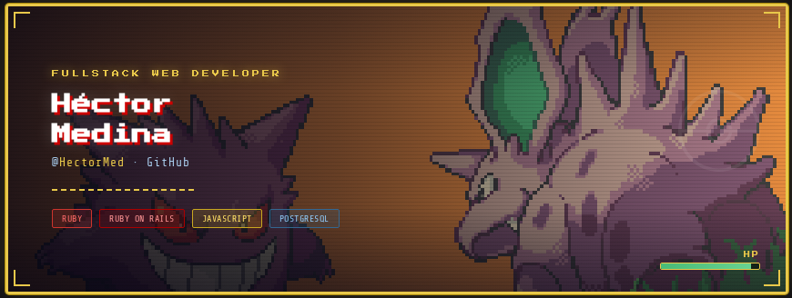

## Sobre mí
Desde que descubrí la programación, me he obsesionado con la idea de poder crear cosas desde cero.

Me llamo Héctor Medina, trabajo desarrollando aplicaciones web con Ruby On Rails. Soy una persona muy curiosa,
siempre estoy leyendo, practicando o experimentando algo relacionado a la programación. 

Disfruto entender cómo funcionan las cosas internamente, resolver problemas y encontrar maneras de mejorar lo que ya existe.
Gran parte de mi inspiración viene de los videojuegos que marcaron mi infancia, especialmente Pokémon y The Legend of Zelda.

## Stack tecnológico

